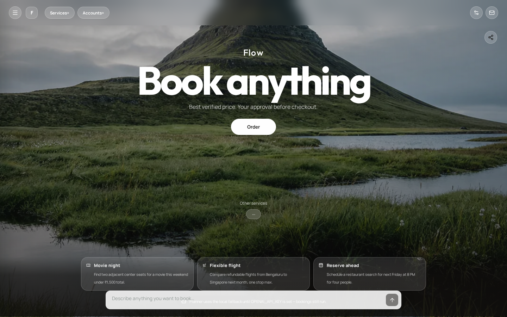

# Flow

Automation for booking anything, anywhere with the best deals.

Flow is a booking co-pilot that:

- Understands plain-language requests (“Tokyo flights under $650”)
- Searches and ranks deals (demo data + live **webcmd** adapters)
- Links Gmail, Calendar, Slack, and more via **Composio** OAuth / MCP
- Walks new users through a **Windows / macOS / Linux** setup wizard

## Quick start

```bash
npm install
npm run dev
```

Open [http://localhost:3000](http://localhost:3000).

Optional environment (`.env.local`):

```bash
COMPOSIO_API_KEY=your_composio_api_key
# WEBCMD_BIN=/absolute/path/to/webcmd   # defaults to node_modules/.bin/webcmd
# FLOW_FORCE_DEMO=1                     # always use demo deals
```

## Setup wizard

On first visit, Flow opens a setup dialog:

1. Welcome — what Flow does
2. Your device — macOS / Windows / Linux commands
3. Runtime — Node.js + clone/run snippets
4. Webcmd — install, doctor, skills
5. Accounts — one-click Composio auth + Cursor MCP instructions
6. Ready — enter the workspace

Re-open anytime with **Setup** in the header.

### Composio MCP (Cursor)

1. Enable the Composio MCP server in Cursor
2. Ask: “Connect my Gmail account with Composio”
3. Finish OAuth from the auth link
4. Refresh Flow’s Accounts panel (or re-open Setup → Accounts)

With `COMPOSIO_API_KEY`, in-app **Link** buttons start the same OAuth flow.

## Webcmd

Flow shells out to [`@agentrhq/webcmd`](https://github.com/agentrhq/webcmd) for adapter discovery and live searches (`trip deals`, `booking search`, `trip flight`, …).

```bash
npx webcmd --version
npx webcmd doctor
npx webcmd list -f json
```

API:

- `GET /api/webcmd` — version, doctor, list
- `POST /api/webcmd` — `{ "args": ["list", "-f", "json"] }`

If a live adapter fails (CAPTCHA / empty), Flow still returns ranked **demo deals** so the product remains usable.

## Composio accounts

- `GET /api/accounts` — linked accounts + toolkit catalog
- `POST /api/accounts` — `{ "toolkit": "gmail", "action": "connect" | "demo-link" }`

## API map

| Endpoint | Purpose |
|----------|---------|
| `GET /api/health` | Service + webcmd + composio health |
| `GET /api/setup/status` | OS detection, install commands, readiness |
| `POST /api/chat` | Conversational booking search |
| `POST /api/booking/search` | Direct deal search |
| `GET/POST /api/webcmd` | Webcmd status and command runner |
| `GET/POST /api/accounts` | Composio account linking |

## Demo

See [`demo/`](./demo) for screenshots, a walkthrough video, and a scripted tour.



```bash
npm run test:api      # smoke-test APIs (server must be running)
npm run demo:capture  # regenerate screenshots + video
```

## Scripts

| Script | Description |
|--------|-------------|
| `npm run dev` | Next.js dev server on :3000 |
| `npm run build` | Production build |
| `npm start` | Production server |
| `npm run test:api` | API smoke tests |
| `npm run demo:capture` | Capture demo screenshots/video |
| `npm run lint` | ESLint |

## License

MIT
